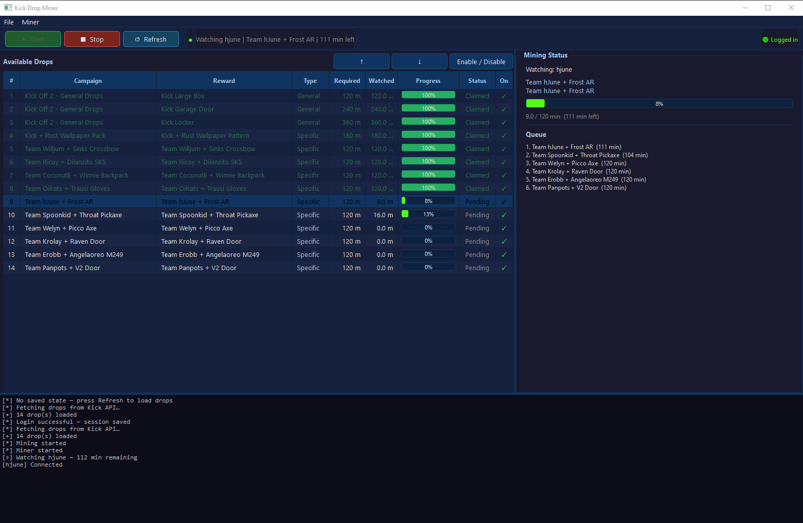

# Kick Drop Miner

A desktop app for automatically farming and claiming drops on [Kick.com](https://kick.com).



---

## Features

- **Auto-discovers drops** — fetches all active drop campaigns from the Kick API
- **Browser login** — sign in via the built-in WebView2 window; supports Google, Apple, and email
- **Auto-mines** — watches streams via WebSocket to accumulate drop progress
- **Auto-claims** — automatically claims drops as soon as they're complete
- **Priority queue** — reorder drops with up/down buttons or set an exact position
- **Enable / disable** — skip specific drops without removing them
- **Live status panel** — shows the current stream, progress bar, and upcoming queue
- **Persistent state** — drop list and progress survive restarts

---

## Usage

**With Python:**
```bash
pip install -r requirements.txt
python main.py

---

## Credits

WebSocket mining logic based on [kickautodrops](https://github.com/PBA4EVSKY/kickautodrops) by [@PBA4EVSKY](https://github.com/PBA4EVSKY).
